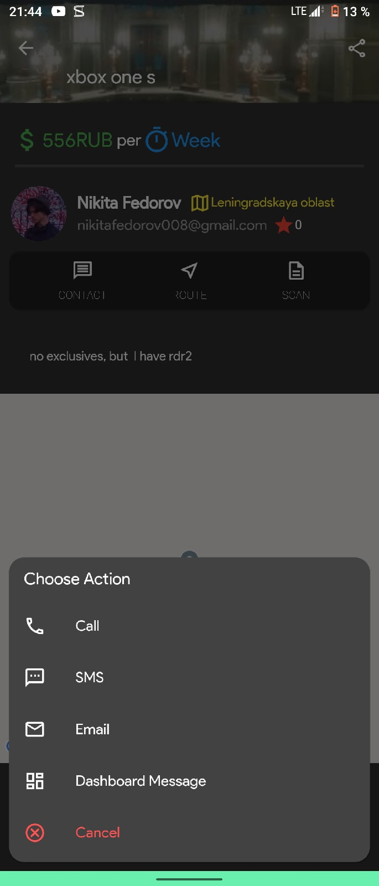

# folka
                                                     
Flutter edition of Polka(Shelf) app

## Warning: this app isn't finally done for ios

This project is kind of Flutter application.

Here there is list of few resources are used in this Flutter project:

- [Marcus NG instagram clone](https://github.com/MarcusNg/flutter_instagram_clone)
- [Stuff: open source marketplace app example](https://github.com/dvmjoshi/stuff)
- [Documentation for migration to android X (if your project has no android X packages)](https://www.cnblogs.com/hupo376787/p/10563454.html)
- [Bottom bar navigation with floating action button](https://medium.com/coding-with-flutter/flutter-bottomappbar-navigation-with-fab-8b962bb55013)
- [Illustrations for projects](https://undraw.co/)

##Screenshots

Android

    
    
    

Ios

  

For help getting started with Flutter, view
[online documentation](https://flutter.dev/docs), which offers tutorials,
samples, guidance on mobile development, and a full API reference.
Also check [pub.dev](https://pub.dev/) to find and use packages to build Dart and Flutter apps.
